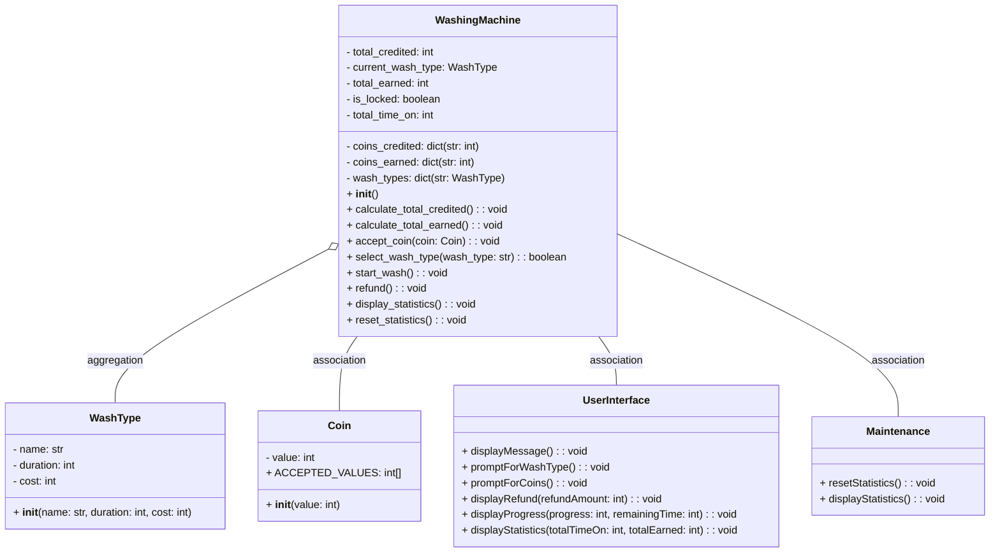

# Design a Washing Machine

## Problem Statement

You will need to design and build a washing machine system that will be used in a laundromat which:

1. Accept coins of 10 cents, 20 cents, 50 cents and 1 dollar.

2. Allow user to select different types of washing types.
   1. Quick Wash (10 minutes - $2)
   2. Mild Wash (30 minutes - $2.50)
   3. Medium Wash (45 minutes - $4.20)
   4. Heavy Wash (1 hour - $6)

3. Before the washing job starts:
   1. Allow user to take refund when cancelling the washing request.
   2. Prompt the user if it is insufficient for the washing job.
   3. Refund the user if there is excess for the washing job.

4. Start, During or Completion of the washing job:
   1. Lock or unlock the washing machine door during start or completion.
   2. Update the user on the current progress of the washing job by Percentage and Remaining Time.

5. Maintenance:
   1. Display quick statistics on the washing machine.
      1. Total time switched on.
      2. Amount of money earned since in service or reset.
   2. Allow reset operation for the statistics for washing machine owner.

You are free to implement the solution in the language of your choice. You can demonstrate the functionality of your code in either a simple graphical UI or on the console.

Design and document the solution, provide a class diagram, and provide the necessary examples or commands to demonstrate that the above requirements are met.

Your code shall be able to handle interactions and show the status of the washing machine at any given point in time (e.g., function to open washing machine door, status of current wash).

## Class Diagram



## Run the code

To test the requirements:

```python
python test.py -v
```
